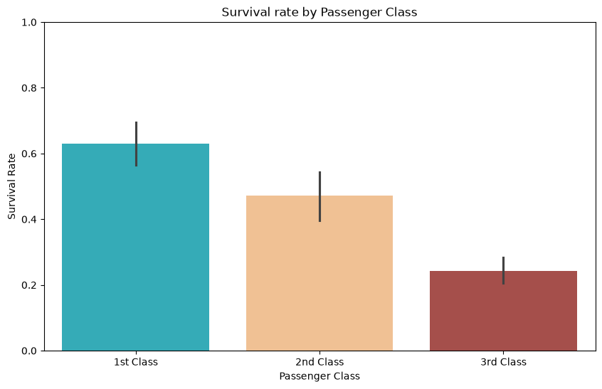
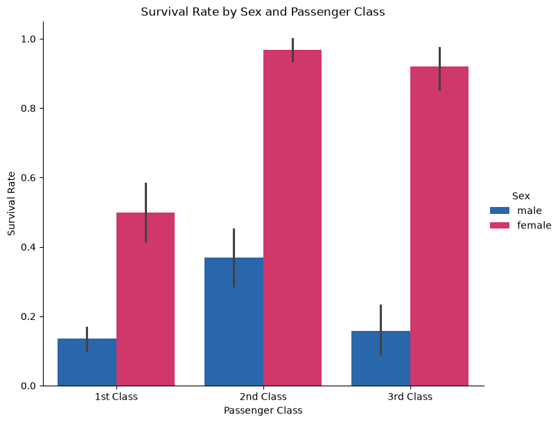

# Project : Titanic Survival Analysis - Exploratory Data Analysis (EDA)
<br>
<!-- Project Goal-->
<h2>Project Goal :</h2>
<p>This project performs Exploratory Data Analysis (EDA) on the famous Titanic dataset.</p>
<p>That Analyze the Titanic Passenger data and find out which factor affected survival (Age,Gender,Class,Fare,etc.) Using Python, Pandas, Matplotlib and Seaborn.</p>

<!-- Dataset -->
## Dataset :
- **Source**: [Kaggle Titanic Dataset](https://www.kaggle.com/c/titanic)
- **File Used**: `train.csv`
- **Description**: Contains information about passengers such as age, sex, passenger class, fare, survival status, etc.

<!-- Tools and Libraries used -->
<h2> Tools and Libraries Used : </h2>

| _Tools and libraries_ |
|--------|
| 1. Python |
| 2. Pandas |
| 3. Numpy  |
| 4. Matplotlib |
| 5. Seaborn |
| 6. Jupyter Notebook |

<!-- Step by Step Project Roadmap !-->
<h2> Project Structure :</h2>

```
Titanic_Survival_Analysis-EDA/
├──data/
│   └── train.csv
│   └── Titanic_Data_Dictionary.xlsx
├──images/
│   ├──Bivariate Analysis Image/
│   ├──Multivariate Analysis Image/
│   ├──Univariate Analysis Image/
│   └── Missing Value Count.png
├──notebooks/
│   └── Titanic_EDA.ipynb
└── README.md
└── requirements.txt

```
<!-- Key Insight (With Scrrenshot of Chart) -->
## Key Insights (With some Screenshot) : 

1. **Overall Survival Rate**  
   Only about **38%** of the passengers survived.

2. **Gender Impact**  
   Females had a significantly higher survival rate compared to males.

   

3. **Passenger Class Impact**  
   - 1st Class passengers had the highest survival rate  
   - 3rd Class passengers had the lowest survival rate

   

4. **Age Distribution**  
   Most passengers were between 20 to 40 years old. Children had relatively better survival chances.

5. **Fare Insight**  
   Passengers who paid higher fares generally had better survival rates (linked to higher passenger class).

6. **Combined Effect (Sex + Passenger Class)**  
   Females in 1st Class had the highest chance of survival, while males in 3rd Class had the lowest.

   

<!-- How run the Project -->

## How Run the Project :

   1. Clone the Repository:

      ```
      git clone https://github.com/Rohit-Bansode/Titanic_Survival_Analysis-EDA.git
      ```
   2. Navigate to the Project folder :
   
      ```
      cd Titanic_Survival_Analysis-EDA
      ```
   3. Install the required libraries:
      
      ```
      pip install -r requirements.txt
      ```
   4. Open the Jupyter Notebook:

      ```
      notebooks/Titanic_EDA.ipynb
      ```
   5. Run all the cells to see the complete analysis.

<!-- Author Details -->

## Author :

**Name: Rohit Mansing Bansode**

<u>Aspiring Data Analyst</u>

- Github : https://github.com/Rohit-Bansode
- Linkedin : https://www.linkedin.com/in/rohit-bansode-0861b8276
- Email : rohitbansode924@gmail.com
