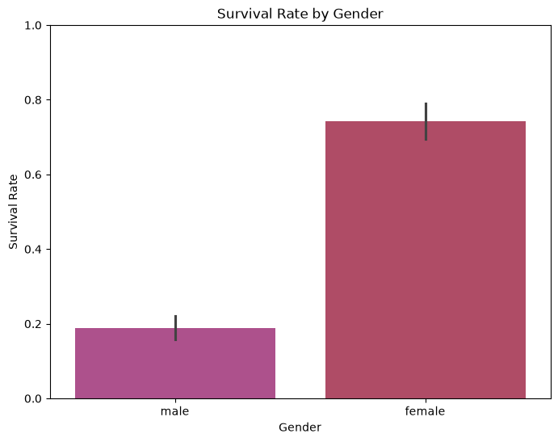

# Project : Titanic Survival Analysis - Exploratory Data Analysis (EDA)
<br>
<!-- Project Goal-->
<h2>Project Goal :</h2>
<p>This project performs Exploratory Data Analysis (EDA) on the famous Titanic dataset.</p>
<p>That Analyze the Titanic Passenger data and find out which factor affected survival (Age,Gender,Class,Fare,etc.) Using Python, Pandas, Matplotlib and Seaborn.</p>

<!-- Dataset -->
## Dataset :
- **Source**: [Kaggle Titanic Dataset](https://www.kaggle.com/c/titanic)
- **File Used**: `train.csv`
- **Description**: Contains information about passengers such as age, sex, passenger class, fare, survival status, etc.

<!-- Tools and Libraries used -->
<h2> Tools and Libraries Used : </h2>

| _Tools and libraries_ |
|--------|
| 1. Python |
| 2. Pandas |
| 3. Numpy  |
| 4. Matplotlib |
| 5. Seaborn |

<!-- Step by Step Project Roadmap !-->
<h2> project Structure :</h2>

```
Titanic_Survival_Analysis-EDA/
├──data/
│   └── train.csv
│   └── Titanic_Data_Dictionary.xlsx
├──images/
│   ├──Bivariate Analysis Image/
│   ├──Multivariate Analysis Image/
│   ├──Univariate Analysis Image/
│   └── Missing Value Count.png
├──notebooks/
│   └── Titanic_EDA.ipynb
└── README.md
└── requirement.txt

```
<!-- Key Insight (With Scrrenshot of Chart) -->
## Key Insights (With some Screenshot) : 

1. **Overall Survival Rate**  
   Only about **38%** of the passengers survived.

2. **Gender Impact**  
   Females had a significantly higher survival rate compared to males.

   


<!-- How run the Project -->


